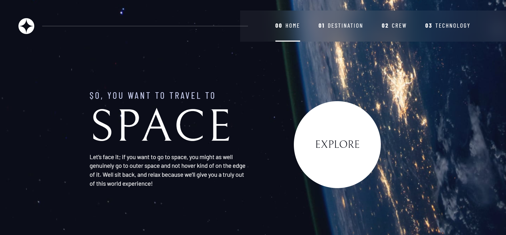

# Frontend Mentor - Space tourism website solution

This is a solution to the [Space tourism website challenge on Frontend Mentor](https://www.frontendmentor.io/challenges/space-tourism-multipage-website-gRWj1URZ3). Frontend Mentor challenges help you improve your coding skills by building realistic projects. 

## Table of contents

- [Overview](#overview)
  - [The challenge](#the-challenge)
  - [Screenshot](#screenshot)
  - [Links](#links)
- [My process](#my-process)
  - [Built with](#built-with)
  - [Useful resources](#useful-resources)
- [Author](#author)
- [Acknowledgments](#acknowledgments)

## Overview

### The challenge

Users should be able to:

- View the optimal layout for each of the website's pages depending on their device's screen size
- See hover states for all interactive elements on the page
- View each page and be able to toggle between the tabs to see new information

### Screenshot

### Links

- Solution URL: [Add solution URL here](https://www.frontendmentor.io/solutions/frontend-mentor-space-tourism-rCF3-OA3Lt)
- Live Site URL: [Add live site URL here](https://space-tourism-frontend-mentor.netlify.app/)

## My process

### Built with

- Semantic HTML5 markup
- CSS custom properties
- Flexbox
- CSS Grid
- Mobile-first workflow
- Accessibility
-

### Useful resources

- [w3schools](https://www.w3schools.com/) - This helped me for some definitions in css and javascript. I really liked this pattern and will use it going forward.
- [Grid cheatSheet](https://grid.malven.co/) - This is an amazing cheatSheet which helped me navigate and understand Grid. I'd recommend it to anyone still learning struggling with Grid.

## Author

- Website - [Adel Fael](https://adelfael.netlify.app/)
- Frontend Mentor - [@Adel-Fael](https://www.frontendmentor.io/profile/Adel-Fael)

## Acknowledgments

Thanks to Kevin Powell. He is a treasure.
